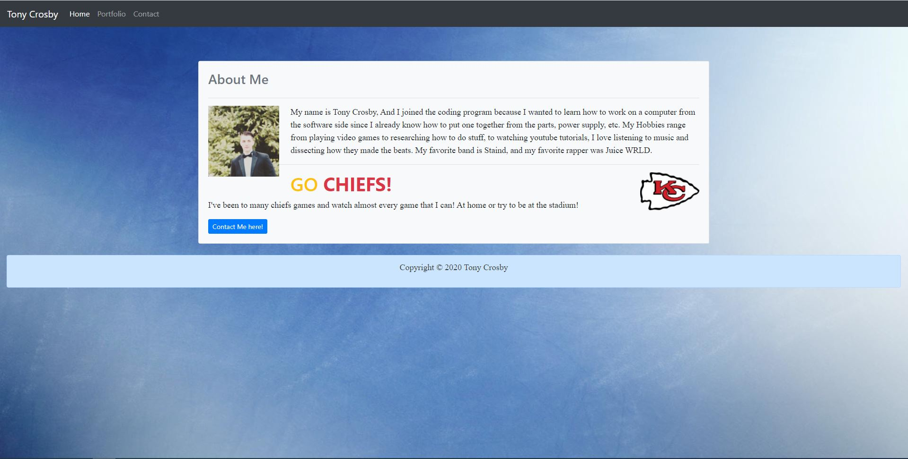

# User Acceptance 

> ## The Navbar is where you will click through the 3 Different Sections (Home, Portfolio, Contact) that will then redirect you to a certain Page of the Website.

> ## The Homepage, Portfolio and Contact pages have cards and some images that are responsive to every device.

> ## All links work All links use semantic html and each page has the correct html, while this portfolio contains my personal information.

> ## I've decided to add a sticky footer including my Copyright for the **BONUS**

# Responsiveness

> ## Responsive layout for all devices, including phones. Responsive images for all devices. It's functional and can be deployed as a webpage.

# Link to the page

> https://tonycrosby.net/portfolio_updated/index.html

# Link to the repository

> https://github.com/tonycrosby-tech/portfolio_updated